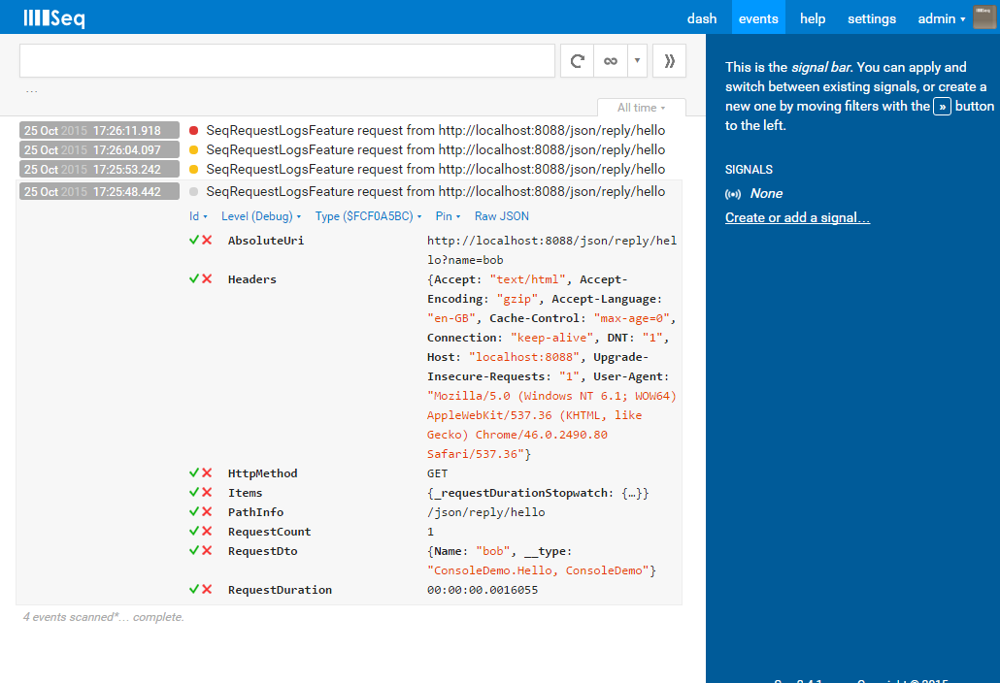

# ServiceStack.SeqRequestLogsFeature

[](https://ci.appveyor.com/project/wwwlicious/servicestack-seq-requestlogsfeature/branch/v3)

A ServiceStack plugin that logs requests to [Seq](http://getseq.com)

*NB. This version is compatible with ServiceStack v3.x. For v4 compatibility, use the master branch*

# Installing

The package is available from nuget.org

`Install-Package ServiceStack.Seq.RequestLogsFeature`

# Requirements

You must have an instance of seq server to post to. You can download and install a copy of Seq [here](http://getseq.com).

# Usage

In your app host add the plugin and specify your seq url and optional seq apiKey.

```csharp
public override void Configure(Container container)
{
  // Config examples
  Plugins.Add(new SeqRequestLogsFeature("http://localhost:5341", "seq-api-key"));
}
```

]
